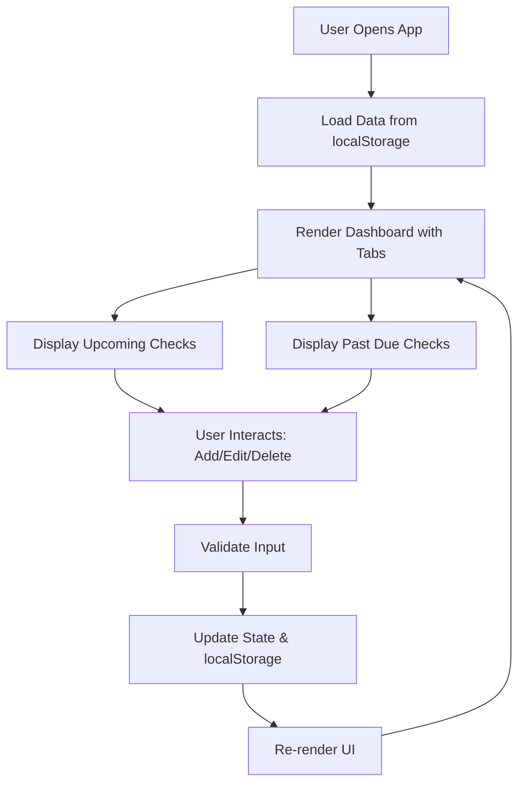

# Check Management Web Application - Architecture Plan

## Overview
This client-side React application manages personal or business checks with a clean, intuitive interface. All data is stored locally using browser localStorage, ensuring no server-side dependencies.

## Technology Stack
- **Frontend Framework**: React (chosen for component-based development)
- **Styling**: CSS3 with responsive design
- **Data Persistence**: Browser localStorage
- **Build Tool**: None (direct browser run via HTML file)

## System Architecture

### Data Model
Each check entry will have the following structure:
```javascript
{
  id: string (unique identifier),
  type: "Given" | "Taken",
  amount: number,
  dueDate: Date,
  receiveDate: Date | null,
  counterparty: string,
  bank: string,
  checkNumber: string (unique)
}
```

### Component Hierarchy
- **App**: Root component managing global state
  - **Dashboard**: Main container with tabs
    - **UpcomingChecksTab**: Displays checks with future due dates
    - **PastDueChecksTab**: Displays checks with past due dates
    - **CheckList**: Reusable list component for displaying checks
      - **CheckItem**: Individual check display with actions
    - **CheckForm**: Form for adding/editing checks
    - **SummarySection**: Displays total amounts

### State Management
- Use React's useState and useEffect hooks
- Data stored in localStorage as JSON
- Automatic persistence on state changes

## Key Features Implementation

### CRUD Operations
- Add: Form validation and localStorage sync
- Edit: Pre-populate form, update existing entry
- Delete: Confirmation dialog, remove from storage
- Validation: Required fields, unique check numbers, date formats

### Sorting & Filtering
- Sort by: Due Date, Amount, Type, Balance
- Filter by: Type (Given/Taken), Date range
- Real-time updates without page refresh

### Reminders & Notifications
- Browser-based notifications for upcoming due dates (e.g., 3 days before)
- User permission request for notifications
- Reminder settings configurable per check

### Grid Layout & Balance Calculation
- Table-based grid layout for better data visualization
- Balance column showing running total of given vs received amounts
- Given checks subtract from balance, received checks add to balance
- RTL-friendly grid layout with Persian column headers
- Sortable columns with visual indicators

## UI/UX Enhancements

### Tab Order Optimization
- Past Due checks displayed first (higher priority)
- Upcoming checks displayed second
- Improved user focus on overdue items

### Jalali Datepicker Integration
- Replace HTML date inputs with Zaman Persian datepicker
- Native Persian calendar support
- Culturally appropriate date selection interface
- RTL-friendly datepicker popup

## Persian RTL Implementation Plan

### Layout & Styling
- HTML `dir="rtl"` attribute for RTL text direction
- CSS `direction: rtl` for proper element flow
- Persian fonts: 'Vazir', 'Tahoma', sans-serif
- RTL-specific styling for forms, buttons, and layouts

### Language & Localization
- Translate all UI text to Persian
- Persian date formatting with Jalali calendar
- Currency display in Iranian Rial (تومان)
- RTL-friendly form layouts and input alignment

### Components Updates
- Form labels and placeholders in Persian
- Button text and action labels translated
- Error messages and validation text in Persian
- Summary section with Persian labels

### Technical Considerations
- Maintain existing functionality while adding RTL support
- Ensure responsive design works with RTL layout
- Browser compatibility for Persian text rendering
- Local storage keys remain in English for consistency

### Responsive Design
- Mobile-first CSS approach
- Flexible grid layouts
- Touch-friendly interface elements

### User Interface
- Clean, modern design with intuitive navigation
- Tabs for Upcoming/Past Due checks
- Modal forms for add/edit operations
- Summary dashboard with key metrics

### UI Design & Tablet Optimization

#### Visual Design Enhancements
- Modern Persian-inspired color palette with gradients
- Consistent Vazir font application across all UI elements
- Enhanced visual hierarchy with color-coded elements
- Subtle animations and hover effects for better UX

#### Font Consistency
- Universal Vazir font for tabs, buttons, dropdowns, and form elements
- Proper Persian font rendering for all interactive elements
- Consistent typography scale throughout the application

#### Tablet Optimization
- Responsive design for 768px-1024px tablet screens
- Larger touch targets (44px minimum) for tablet interaction
- Optimized spacing and layout for tablet viewing
- Improved navigation and form usability on tablets

### Layout Enhancements

#### Tab Repositioning
- Move navigation tabs from top to bottom of forms
- Improved UX with tabs positioned after content
- Better visual flow in Persian RTL layout

#### Grid Table Improvements
- Add row numbering/ID column for better data tracking
- Sequential numbering that maintains order with sorting
- Persian column header for row identification

#### Date Range Filtering
- Due date range filter with Persian Jalali date inputs
- From/To date selection for precise filtering
- Integration with existing sort and type filters
- Clear and reset functionality for date filters

## File Structure
```
/
├── index.html          # Main HTML entry point
├── styles.css          # Global styles
├── app.js              # Main React app
├── components/
│   ├── Dashboard.js
│   ├── CheckList.js
│   ├── CheckItem.js
│   ├── CheckForm.js
│   └── Summary.js
├── utils/
│   ├── storage.js      # localStorage utilities
│   └── validation.js   # Form validation functions
└── data/
    └── initialData.js  # Sample data for development
```

## Workflow Diagram



## PWA (Progressive Web App) Configuration

### Overview
The application will be configured as a Progressive Web App using VitePWA plugin to provide offline functionality, installation capabilities, and automatic updates with user notification popups.

### PWA Features
- **Installable**: Users can install the app on their devices like a native app
- **Offline Support**: Service worker caches static assets and API responses for offline use
- **Update Management**: Automatic detection of new versions with user-friendly update prompts
- **Background Sync**: Handle data synchronization when online
- **Push Notifications**: Browser-based notifications for check reminders (future enhancement)

### Technical Implementation
- **Manifest Configuration**: Define app name, icons, theme colors, and display mode
- **Service Worker**: Handle caching strategies and update events
- **Update Popup**: Custom React component to notify users of available updates
- **Icon Assets**: Multiple sizes (192x192, 512x512) in PNG format and maskable variants

### Icon Requirements
- 192x192px PNG (standard icon)
- 512x512px PNG (high-res icon)
- Maskable variants for adaptive icons on various platforms
- SVG fallback for scalable vector graphics

### Service Worker Strategy
- Cache-first for static assets (CSS, JS, images)
- Network-first for dynamic data (if any API calls added in future)
- Background sync for offline data submissions

### Update Flow
1. New version deployed
2. Service worker detects update
3. App shows update popup with "Update Now" / "Later" options
4. User clicks "Update Now" → page refreshes with new version
5. User clicks "Later" → update applied on next visit

### Notification System
- **Browser Notifications**: Automatic reminders for upcoming check due dates
- **Multiple Reminders**: 3 notifications per check (3 days before, 1 day before, on due date)
- **Permission Management**: Automatic request for notification permissions on app load
- **Custom Messages**: Different messages for each reminder type in Persian
- **Rich Notifications**: Include check number, amount, and due date in notifications
- **Auto-scheduling**: Notifications automatically scheduled when checks are added or loaded

## Implementation Phases
1. Project setup and basic structure
2. Core React components development
3. Data management and persistence
4. PWA configuration and offline support
5. UI/UX polish and responsiveness
6. Testing and refinements

This plan ensures a scalable, maintainable application that meets all specified requirements while keeping everything client-side only with PWA capabilities.